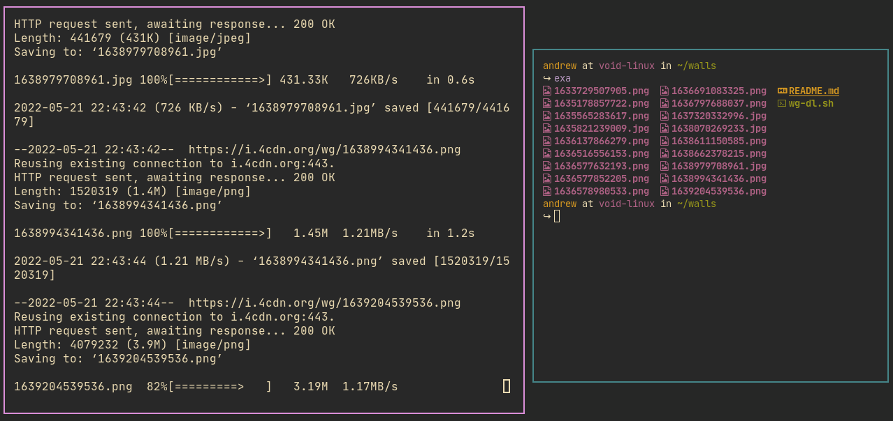

# A single line bash script to download wallpapers from 4chan /wg/

Dependencies:
- curl
- wget
- awk
- pup

PS: I know [4Chan API](https://github.com/4chan/4chan-API) exists. This was made to demonstrate the abilities of plain POSIX-complained shell and GNU coreutils. 
